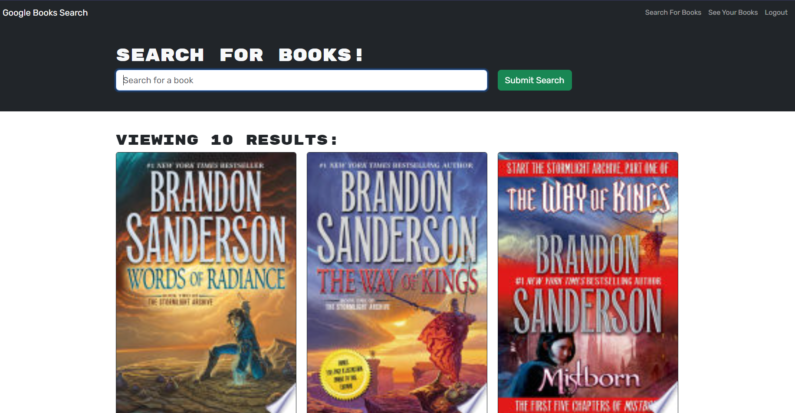

# Google Book Search MERN Application

Welcome to the Google Book Search MERN Application! This application allows users to search for books using the Google Books API and save their favorite books to their profile. It is built using the MERN stack and provides a seamless user experience for searching and managing books.  The deployed application can be found at: [Google Book Search MERN Application](https://book-search-mern-6fddda49033d.herokuapp.com/).



## Table of Contents

- [Features](#features)
- [Technologies Used](#technologies-used)
- [Installation](#installation)
- [Usage](#usage)
- [Contact](#contact)
- [License](#license)

## Features

- **Search Books**: Users can search for books using keywords, titles, authors, or other relevant criteria.
- **Save Books**: Users can save their favorite books to their profile for later reference.
- **View Saved Books**: Users can view the books they have previously saved.
- **Remove Books**: Users can remove books from their saved list if they no longer wish to keep them.

## Technologies Used

- **MongoDB**: NoSQL database used to store user data and saved books.
- **Express.js**: Web application framework used for building the server-side application.
- **React.js**: JavaScript library used for building the user interface components.
- **Node.js**: JavaScript runtime environment used for server-side development.
- **Google Books API**: External API used for fetching book data.
- **Apollo Server**: GraphQL server used for managing API requests and data flow.
- **bcryptjs**: Library used for hashing user passwords for security.
- **jsonwebtoken**: Library used for generating and verifying JSON Web Tokens (JWT) for user authentication.

## Installation

To run the Google Book Search MERN Application locally, follow these steps:

1. Clone the repository from GitHub:

   ```bash
   git clone https://github.com/your-username/google-book-search.git
   ``````

2. Install dependencies.  It is important to run this from the root of the project to install packages for both the client and server.

    ```bash
    npm run install
    ``````

3. Start the development server:

    ```bash
    npm run develop
    ``````

4. Access the application at http://localhost:3000 in your web browser.

## Usage
**Search Books:** Enter keywords, titles, authors, or other relevant criteria into the search bar to find books.
**Save Books:** Click on the "Save" button to add a book to your saved list.
**Delete Books:** Click on the "Delete" button to remove a book from your saved list.

## License
[License: MIT](https://opensource.org/licenses/MIT)

## Contact

If you have any questions, please feel free to contact me using the information provided below.
  
GitHub: [chilejay7](https://github.com/chilejay7?tab=repositories)  
Email: codyburk7@gmail.com
